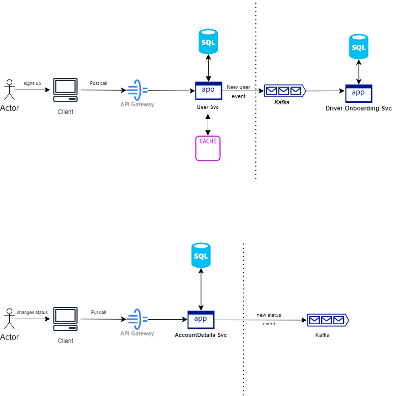
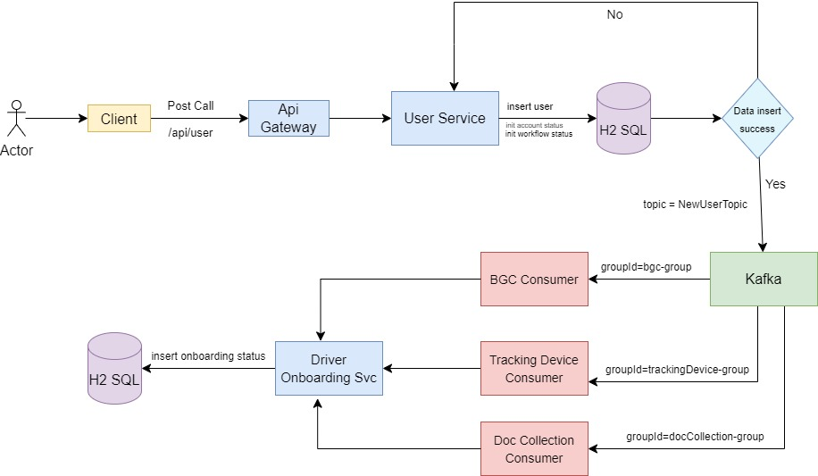
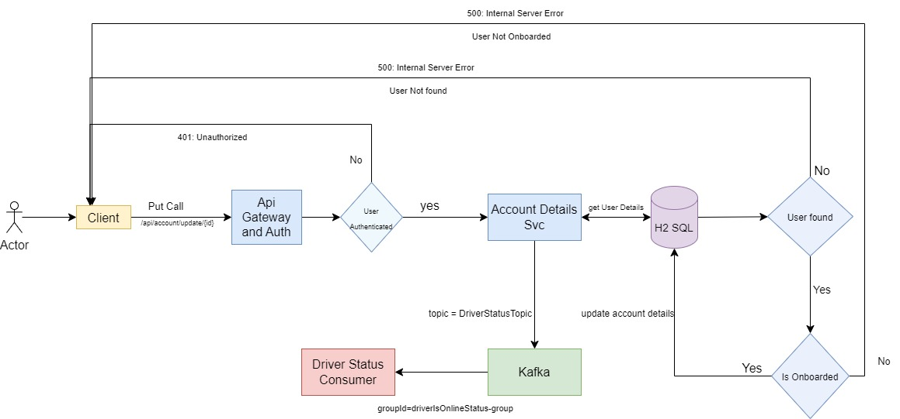
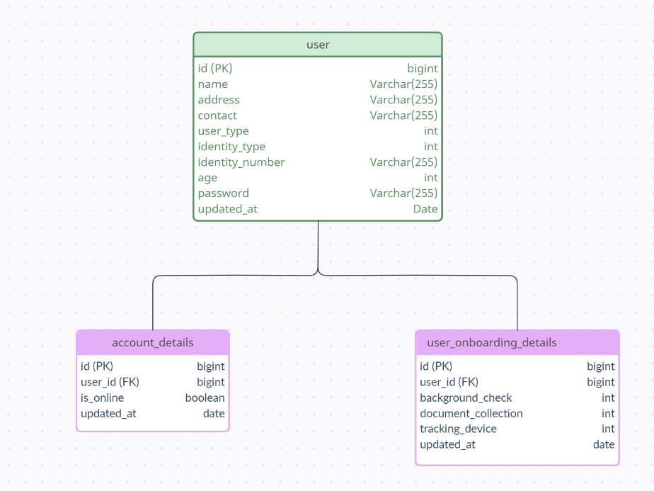

# Uber Driver Onboarding Module

## Overview

You are part of a team, building a ride management application like Uber. You are responsible
for the driver onboarding module. As part of this module you are required to build an
interface that will allow a driver to sign-up as a driver partner. The driver onboarding module
should:
- Allow a driver to sign-up and enter their profile information
- Trigger onboarding processes like document collection, background verification, shipping
of tracking device, etc., 
- Allow a driver to mark when they are ready to take a ride

### Table of contents:

- [Detailed Approach](#detailed-approach)
    - [Flow Diagrams](#flow-diagrams)
- [Alternate Approaches](#alternate-approaches)
    - [Redis Sorted Set](#alternate-approach-1-redis-sorted-set)
    - [DB Read Replica](#alternate-approach-2-db-read-replica)
    - [Pod Local Cache](#alternate-approach-3-pod-local-cache)
- [API Contracts](#api-contracts)
- [DB Schema](#db-schema)
- [Local Development](#local-development)
    - [Testing](#testing)
    - [PR Guidelines](#pr-guidelines)


## Detailed Approach



`Leaderboard-Service` consumes events from `Kafka` and stores the data in `MySQL`. It also maintains a cache(`Memcached`)
to serve the traffic. We have a `cache-aside` arrangement here, which means that we will first check the cache for the data
and if it is not present in the cache, then we will fetch it from the DB and store it in the cache for future use.


| Dimension       | Salient Points                                                                     |
|-----------------|------------------------------------------------------------------------------------|
| Cost            | + Cheap at scale                                                                   |
| Complexity      | ~ Low/Medium complexity setting up a `cache-aside` arrangement                     |
| Scalability     | + Highly scalable and can serve huge amounts of reads at low latency               |
| User Experience | ~ User might get stale data, but  `lastUpdatedAt` can be used to provide better UX |

### Flow Diagrams

#### Sign up new user



#### Mark user ready



## Alternate Approaches

### Alternate Approach 1 (Redis Sorted Set)


Here we are using `Sorted Sets` in Redis to store the scores. A Redis sorted set is a collection of unique strings
(members) ordered by an associated score. We can use this property to maintain the top scores for a game, and it will be
automatically ordered. On every write we will also update the entry for the user in MySQL DB as well which will act as a backup
and serve traffic when redis is down. MySQL here also works as a persistent store for the scores data. We require this as by
default Redis does not support persistence, though we enable persistence and HA in Redis and remove MySQL as a backup.


| Dimension       | Salient Points                                                                                                                                                                             |
|-----------------|--------------------------------------------------------------------------------------------------------------------------------------------------------------------------------------------|
| Cost            | ~ Costs higher than Memcache, local-pod-cache<br/> ~ Costs ~= using DB read replicas                                                                                                       |
| Complexity      | ~ While low dev complexity, using a complex data-structure like `Sorted Sets` leads to a more complex solution<br/> - Vendor/Technology lock-in as using redis proprietary Data Structures |
| Scalability     | + Redis is highly scalable  and can serve huge amounts of reads at low latency                                                                                                             |
| User Experience | + User is always served the latest data                                                                                                                                                    |


### Alternate Approach 2 (DB Read Replica)


This option stores data just in MySQL and uses a read replica to help scale up reads.


| Dimension       | Salient Points                                                                                                                        |
|-----------------|---------------------------------------------------------------------------------------------------------------------------------------|
| Cost            | ~ While not the cheapest, costs should not be as high as using distributed SQL DBs<br/> ~ Costs higher than using a DB+Cache          |
| Complexity      | + Low Complexity as DB replication is handled at the DB layer                                                                         |
| Scalability     | ~ Quite scalable but might need to add a lot of replicas at higher scale<br/> ~ Latency will be higher than using a DB+Cache solution |
| User Experience | ~ User can be served stale date depending on replication lag                                                                          |

### Alternate Approach 3 (Pod Local Cache)


This approach is quite similar to the primary approach, but here we are using a local cache in each pod instead of memcached.


| Dimension       | Salient Points                                                                                                           |
|-----------------|--------------------------------------------------------------------------------------------------------------------------|
| Cost            | ++ Costs are minimal as we are using local pod memory as cache                                                           |
| Complexity      | + Low complexity implementing an in-memory cache<br/> + No additional system required for implementing caching           |
| Scalability     | + Quite scalable as we can scale pod memory horizontally/vertically                                                      |
| User Experience | -- Bad user experience as each pod can store a different value for top-scores, leading to an overall jittery experience  |

## API Contracts

### POST : /api/user

#### Request
```shell
curl --location 'http://localhost:8080/api/user' \
--header 'Content-Type: application/json' \
--data-raw '{
    "userType": "DRIVER",
    "name": "test_name",
    "contact": "886054970",
    "password": "test@123",
    "age": 32,
    "address": "test_address",
    "identityType": "DRIVING_LICENCE",
    "identityNumber": "123456",
    "id": 3
}'
```
#### Response

_**Sample Response**_

Status Code :- 200 (OK)
```json
{
  "httpStatus": "CREATED",
  "data": {
    "id": 1,
    "userType": "DRIVER",
    "name": "test_name",
    "contact": "886054970",
    "password": "ceb6c970658f31504a901b89dcd3e461",
    "age": 32,
    "address": "test_address",
    "identityType": "DRIVING_LICENCE",
    "identityNumber": "123456",
    "updatedAt": "2023-12-31"
  },
  "message": "Created"
}


```

### GET : /api/user/{id}

#### Request
```shell
curl --location 'http://localhost:8080/api/user/1' 
```
#### Response

_**Sample Response**_

Status Code :- 200 (OK)
```json
{
  "httpStatus": "OK",
  "data": {
    "id": 1,
    "userType": "DRIVER",
    "name": "test_name",
    "contact": "886054970",
    "password": "ceb6c970658f31504a901b89dcd3e461",
    "age": 32,
    "address": "test_address",
    "identityType": "DRIVING_LICENCE",
    "identityNumber": "123456",
    "updatedAt": "2023-12-31"
  },
  "message": "OK"
}
```

### PUT : /api/account/update/{user_id}

#### Request
```shell
curl --location --request PUT 'http://localhost:8080/api/account/update/1' \
--header 'Content-Type: application/json' \
--data '{
    "isOnline": true
}' 
```
#### Response

_**Sample Response**_

Status Code :- 200 (OK)
```json
{
  "httpStatus": "OK",
  "data": {
    "id": 1,
    "user": {
      "id": 1,
      "userType": "DRIVER",
      "name": "test_name",
      "contact": "886054970",
      "password": "ceb6c970658f31504a901b89dcd3e461",
      "age": 32,
      "address": "test_address",
      "identityType": "DRIVING_LICENCE",
      "identityNumber": "123456",
      "updatedAt": "2024-01-01"
    },
    "isOnline": true,
    "updatedAt": "2024-01-01"
  },
  "message": "OK"
}
```

### PUT : /api/onboarding/update/{userId}

#### Request
```shell
curl --location --request PUT 'http://localhost:8080/api/onboarding/update/1' \
--header 'Content-Type: application/json' \
--data '{
    "documentCollection": "COMPLETED",
    "backgroundCheck": "COMPLETED",
    "trackingDevice": "COMPLETED"
}'
```
#### Response

_**Sample Response**_

Status Code :- 200 (OK)
```json
{
  "httpStatus": "OK",
  "data": {
    "id": 1,
    "user": {
      "id": 1,
      "userType": "DRIVER",
      "name": "test_name",
      "contact": "886054970",
      "password": "ceb6c970658f31504a901b89dcd3e461",
      "age": 32,
      "address": "test_address",
      "identityType": "DRIVING_LICENCE",
      "identityNumber": "123456",
      "updatedAt": "2024-01-01"
    },
    "documentCollection": "COMPLETED",
    "backgroundCheck": "COMPLETED",
    "trackingDevice": "COMPLETED",
    "updatedAt": "2024-01-01"
  },
  "message": "OK"
}
```

Status Code : 4xx/5xx
```json
{
    "httpStatus": "BAD_REQUEST",
    "data": null,
    "message": "User details not found"
}
```

```json
{
    "httpStatus": "INTERNAL_SERVER_ERROR",
    "data": "User with Contact number - 886054970 Already Exists",
    "message": "Internal Server Error"
}
```

```json
{
    "httpStatus": "BAD_REQUEST",
    "data": null,
    "message": "User is not onboarded yet "
}
```

## DB Schema




## Local Development

1. Clone the repo
2. Install all dependencies ( Make sure java and Kafka are setup already )
3. Run `.\bin\windows\zookeeper-server-start.bat .\config\zookeeper.properties` from dir where Kafka is installed
4. Run `.\bin\windows\kafka-server-start.bat .\config\server.properties` from dir where Kafka is installed
5. This will start your kafka at `localhost:9092`
6. If you run into any error - recheck your environment variables for JAVA_HOME and clean the logs file of Kafka and retry.
7. Run the file [UberOnboardingApplication.java](src/main/java/com/intuit/uber/onboarding/UberOnboardingApplication.java).
8. This will start the Tomcat server at `localhost:8080`
9. You can access the H2 SQL server at http://localhost:8080/h2-console. Refer [application.properties](src/main/resources/application.properties) for credentials.


### Testing
1. Follow the above steps for Local Development.
2. You can use Postman to test the apis
3. Or you can trigger integration tests to verify.

